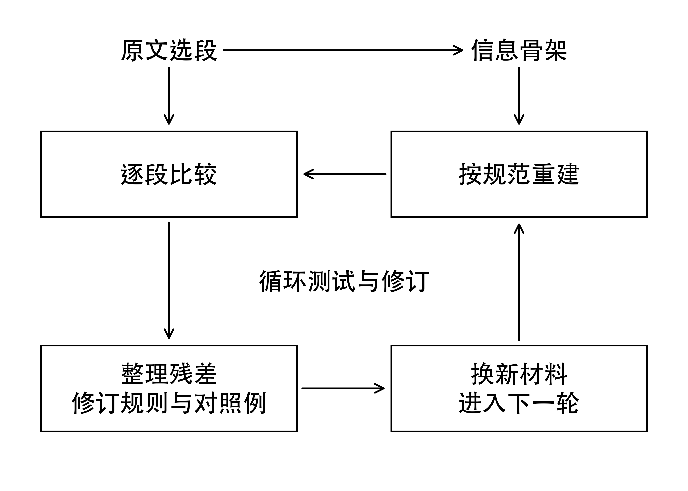
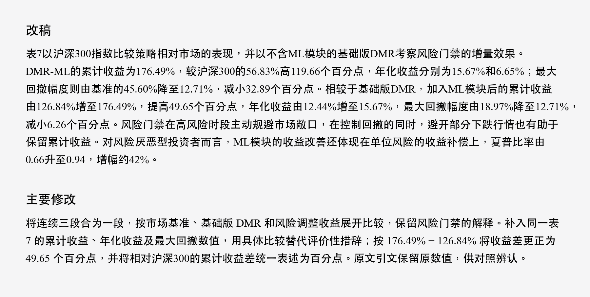
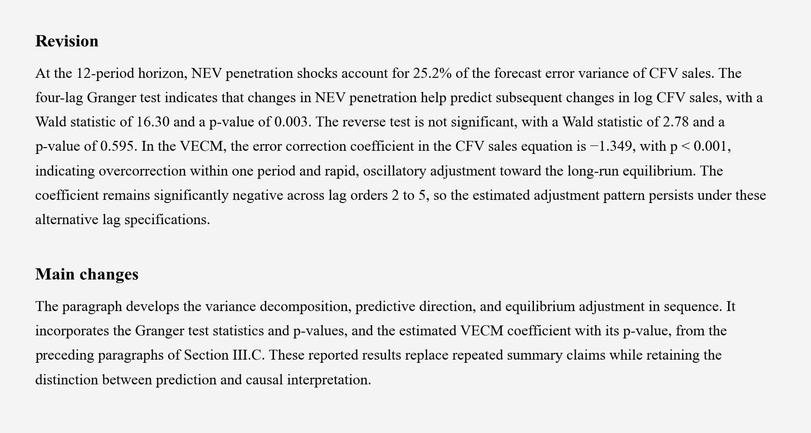

# kai-writing

面向量化金融、统计与机器学习等领域的中英文学术写作。

kai-writing 是供 Codex、Claude Code 等 AI 大模型使用的中英文学术写作 skill。它通过顶刊论文的正文复现与逐段对照开展训练，形成可直接加载的写作规则与对照示例，用于整理研究材料、撰写论文段落和润色初稿。重点处理论证顺序、措辞和段落组织，事实、数值和引用以实际提供的研究材料为准。中英文共用一个文件，可以直接查看[使用方法](#使用方法)、[中英文改稿对照示例](#中英文改稿对照)和[参考文献](#参考文献)。

## 本skill的训练机制

项目从中英文各100篇研究论文中选择材料，提取信息骨架，让模型按当前规范复现正文，再与原文逐段比较。骨架保留研究对象、数据、方法、结果、引用及其推理关系，不保留原文的完整句式；复现时，写作者只看到骨架和现有规范。单纯把顶刊文章交给AI概括写作特征，难以判断这些特征能否落实到具体表达。项目把顶刊原文的表述作为对照学习的真值，让大模型在同一组研究信息下比较复现稿与原文，找出信息安排、证据衔接和措辞上的差距。反复出现的问题被整理成规则和对照例，用于下一轮复现与比较。

每轮先检查骨架是否完整，提取阶段漏掉的内容回到提取阶段处理，再判断复现稿的表达差异是否影响理解或改变了原有判断。根据重复出现的问题提出候选规则，随后用新的材料试写，检查上一轮的问题是否减少、修改是否带来新的问题。作者审阅实际稿件后继续修正规范，下一轮重新执行复现与比较。初始试验使用6篇论文，完成18个正常章节任务和5个乱序对照任务，此后继续做章节测试和真实稿件修改；200篇是参考目录规模，各阶段的工作范围见[开发记录](docs/DEVELOPMENT.md)。

这套反馈思路也受到了笔者读过的两项研究的启发。David Silver 与图灵奖得主 Richard S. Sutton 在 [Welcome to the Era of Experience](https://storage.googleapis.com/deepmind-media/Era-of-Experience%20/The%20Era%20of%20Experience%20Paper.pdf) 中提出，让智能体通过行动、观察和可检验的结果持续学习，并根据经验修正已有认识。FunSearch 则给出了一个具体实现。在发表于 Nature 的 [Mathematical discoveries from program search with large language models](https://doi.org/10.1038/s41586-023-06924-6) 中，语言模型生成候选程序，评估器实际运行并评分，得分较好的程序进入下一轮生成过程。用于装箱问题时，程序要接受实际装箱结果的检验。这两项工作的启发在于让生成结果得到反馈，再据此改进。本项目将这一思路用于写作，以论文原文作对照，由作者审阅事实、论证和表达，逐轮修改可加载的规则与示例。这套训练流程也可供其他方向的 skill 开发参考，读者可以结合各自领域的范例与任务加以调整。欢迎交流实际使用中的经验和问题，一起探索更有效的 skill 训练方法。

## 具体改了哪些问题

**① AI的防御性写作问题。** 研究对象和条件已经交代清楚后，不再补一段材料中没有依据的免责说明。研究实际报告的限制随相关论述保留，给写作者的材料缺项也不改写成研究缺陷。

**② 空泛评价与重复总结。** 删除没有证据支持的自夸，用具体结果和比较说明研究发现。段末若只是换词复述前文，就在已有结果处结束；原稿提供的进一步解释和推理继续展开。

**③ 短段与零碎标题。** 围绕同一项比较，把结果、证据和解释放在连贯的段落中。只承接少量文字的小节合并或去掉标题，论证较长时按内容推进分段，不把一条结果、一句解释和一句总结各拆一段。

**④ 润色时擅自缩写。** 调整段落和措辞时，保留原稿的篇幅量级、论证展开程度和解释深度。合段前核对各段信息，局部去重后仍保留完整比较，不把一篇充分展开的论文改成结果摘要。

**⑤ 数值与比较对象。** 逐项核对数值、单位、分母、时间范围和基准组，保留不确定性与必要条件。不同来源的数字不拼成新的统计量，百分比与百分点也不混用；需要计算时先确认输入与口径齐全。

**⑥ 判断强度。** 改稿保留原有判断的确定程度。相关关系、预测结果和因果效应分别表述，统计显著与实际重要性分开说明。材料中的可能解释不改成已经证实的机制，非显著结果也不直接写成没有效应。

**⑦ 引用与观点归属。** 区分本研究发现、既有文献结论和作者解释，引用紧随它所支持的命题。采用某种方法不等于提出该方法，改换句子主语时也不改变方法、模型与原作者之间的关系。

**⑧ 术语与括注。** 中文稿不反复附注常见术语的英文全称，缩写首次定义后不再重复解释。同一对象、模型和指标保持名称一致；自定义术语、容易混淆的名称及理解比较所需的定义照常写清。

**⑨ 标点与人称。** 普通叙述默认不用冒号，中文正文不用“我们”及“我们的”，以本文、本研究或省略主语表达。公式、代码、直接引文和文献题名按各自用途处理，不为统一表面形式改坏原有含义。

**⑩ 章节组织。** 引言围绕研究问题、已有证据与本文工作展开，结果部分按主要发现和必要比较组织，讨论解释结果含义及素材支持的局限。各章节按内容选择写法，不强填相同的段落模板。

**⑪ 表格与页面排版。** 表格采用三线表，表头写清对象和单位，表内保留便于比较的数字与短语，较长解释移到表注或正文。精简列名、重复文字与换行，统一数字精度，并检查Word或PDF的实际页面。

**⑫ 修改核验。** 正式正文和修改说明分开交付，每项修改应能在实际稿件中找到。附带工具检查部分字面规则、段落编号和修改记录；事实、论证与可读性仍须结合原始材料逐段核对。

## 使用方法

**① 加载规范。** 下载项目，把所在目录交给 Codex 或 Claude Code，要求先完整读取 [SKILL.md](SKILL.md)。中英文已经放在同一个文件里，按当前语言和章节选择规则，无需另行拼接提示词。

**② 提供材料。** 附上初稿、研究笔记或结果表，说明目标语言、章节与篇幅要求。研究结果、供理解的背景和编辑要求分开写；需要保留的比较、引用、解释及特殊格式一并说明。

**③ 指定改稿要求。** 可随稿这样说明。“先完整读取 kai-writing/SKILL.md，按中文结果模式润色下面的正文。保留事实、数值、引用和原稿的论证展开程度，不缩写。把围绕同一问题的短段合并，删去不必要的小标题。正式正文与修改说明分开交付。”写英文时改为英文及对应章节。

**④ 对照检查。** 先核对稿件中的数字、引用和判断，再检查段落、小标题与冗余表达，最后查看Word或PDF的实际页面。需要机械核验时按[工具说明](docs/TOOLS.md)使用附带脚本，保留实际输出供复核。

## 中英文改稿对照

下面两例来自实际稿件。两例供直接比较修改效果。

### 中文案例

来源论文《基于机器学习的双重动量指数轮动策略——以沪深300与中证1000为例》，第 4.3 节“与基准及基础DMR版本的对比”，表 7 后三段。 [详见](docs/EXAMPLES.md#演示改稿)。

#### 原文

相较于沪深300基准，DMR-ML策略在收益端实现了119.66%的绝对超额，在风险端将最大回撤从45.60%压缩至12.71%，改善幅度达32.89个百分点。这一结果表明，双重动量机制结合ML风险门禁能够在A股市场获取显著的风险调整超额收益。

相较于基础版DMR策略，DMR-ML在累计收益上提升了49.66个百分点，在最大回撤上改善了6.26个百分点，夏普比率从0.66提升至0.94。这一对比清晰地展示了ML风险门禁模块的增益贡献：通过在高风险时段主动规避市场敞口，策略不仅降低了回撤幅度，还因避开了部分下跌行情而间接提升了累计收益。

ML模块的贡献并非仅仅体现在绝对收益的提升上，更重要的是风险调整效率的改善。夏普比率从0.66提升至0.94，意味着每承担一单位风险所获得的收益补偿提高了42%。对于风险厌恶型投资者而言，这一改善具有实质性的价值。

### English example

Source paper, Forecasting Clean Vehicle Adoption and Market Substitution Dynamics in China's Automotive Transition, Section III.C, “Identification of Substitution Dynamics,” final paragraph on page 5. [Revision and notes as selectable text](docs/EXAMPLES.md#demonstration-revision).

#### Original

The variance decomposition further reveals that penetration shocks account for 25.2% of the forecast error variance of CFV sales at the 12-period horizon, confirming that penetration is a substantively important, though not the sole, driver of CFV sales dynamics. The VECM error correction coefficient remains significantly negative across lag orders 2 to 5, confirming the stability of the long-run equilibrium result. Taken together, the Granger test establishes unidirectional temporal precedence from penetration to CFV sales, the VECM confirms a stable long-run equilibrium with rapid error correction, and the variance decomposition quantifies the magnitude of this influence. These results provide convergent evidence that the NEV-to-CFV substitution dynamic is not merely a statistical correlation but a directional, self-correcting process.

## 参考文献

供skill训练的参考论文共200篇，其中中文、英文各100篇，详见[书目来源说明](docs/BIBLIOGRAPHY_NOTES.md)。

### 刊物与载体分布

期刊论文195篇、期刊在线提前发表版本1篇、会议论文2篇、预印本2篇。

#### 中文（100篇）

##### 统计研究（24篇）

[1] 张雨露, 平卫英, 罗良清. 数据要素供给使用核算框架研究[J]. 统计研究, 2026, 43(1): 15-28. DOI: [10.19343/j.cnki.11-1302/c.2026.01.001](https://doi.org/10.19343/j.cnki.11-1302/c.2026.01.001). [原文](https://tjyj.cbpt.cnki.net/portal/journal/portal/client/paper/af00cc9ab31ad2abade2cec91462e0db).

[2] 苏冰杰, 许永洪. 中国数字经济热度结构与区域网络关系透视——基于互联网大数据的高频指数构建[J]. 统计研究, 2026, 43(1): 71-84. DOI: [10.19343/j.cnki.11-1302/c.2026.01.005](https://doi.org/10.19343/j.cnki.11-1302/c.2026.01.005). [原文](https://tjyj.cbpt.cnki.net/portal/journal/portal/client/paper/1300939221c601ed7a9c69c9d0157fdd).

[3] 郑冰, 赵彦云. 数字经济发展如何影响区域碳排放强度？——基于省级面板数据的实证分析[J]. 统计研究, 2026, 43(1): 85-97. DOI: [10.19343/j.cnki.11-1302/c.2026.01.006](https://doi.org/10.19343/j.cnki.11-1302/c.2026.01.006). [原文](https://tjyj.cbpt.cnki.net/portal/journal/portal/client/paper/16067896b35799f26ed148c544a48a50).

[4] 张中艳, 王小燕. 多源数据的Knockoff-Cox整合分析模型及其信用违约预警应用[J]. 统计研究, 2026, 43(2): 118-130. DOI: [10.19343/j.cnki.11-1302/c.2026.02.009](https://doi.org/10.19343/j.cnki.11-1302/c.2026.02.009). [原文](https://tjyj.cbpt.cnki.net/portal/journal/portal/client/paper/a10c413ac1116996e616c526ca64a579).

[5] 李佼瑞, 邓迪, 张雨筱. 多种通胀机制约束的时序卷积网络模型改进及其在CPI预测中的应用[J]. 统计研究, 2026, 43(2): 131-143. DOI: [10.19343/j.cnki.11-1302/c.2026.02.010](https://doi.org/10.19343/j.cnki.11-1302/c.2026.02.010). [原文](https://tjyj.cbpt.cnki.net/portal/journal/portal/client/paper/3339f8cc1fe6f6e98108476417e6495a).

[6] 李磊, 路优, 盛斌. 全球芯片产业链韧性测度、特征与驱动因素——基于复杂网络视角[J]. 统计研究, 2026, 43(2): 3-17. DOI: [10.19343/j.cnki.11-1302/c.2026.02.001](https://doi.org/10.19343/j.cnki.11-1302/c.2026.02.001). [原文](https://tjyj.cbpt.cnki.net/portal/journal/portal/client/paper/d00e976ed76855f094f9bcebfda4580e).

[7] 左文进, 曾守桢, 苏为华, 张兴贤. 兼顾公平与效率的数据价值链收益分配测度研究[J]. 统计研究, 2026, 43(3): 39-51. DOI: [10.19343/j.cnki.11-1302/c.2026.03.003](https://doi.org/10.19343/j.cnki.11-1302/c.2026.03.003). [原文](https://tjyj.cbpt.cnki.net/portal/journal/portal/client/paper/3fefdfdebbc3c40590b92a1d973b8c3d).

[8] 孙传旺, 徐梦洁, 王博. 数字经济影响能源产出率的动因分解与路径识别——基于可解释性机器学习的研究[J]. 统计研究, 2026, 43(3): 52-66. DOI: [10.19343/j.cnki.11-1302/c.2026.03.004](https://doi.org/10.19343/j.cnki.11-1302/c.2026.03.004). [原文](https://tjyj.cbpt.cnki.net/portal/journal/portal/client/paper/096350aaaac78a1ec5ddfce0ea66d0e3).

[9] 陈建宝, 李铂桂. 具有可分时空过滤器的固定效应半参数单指标面板模型的估计和检验[J]. 统计研究, 2026, 43(3): 134-146. DOI: [10.19343/j.cnki.11-1302/c.2026.03.010](https://doi.org/10.19343/j.cnki.11-1302/c.2026.03.010). [原文](https://tjyj.cbpt.cnki.net/portal/journal/portal/client/paper/5b7957db2737995b3e2f1cc12c012c5c).

[10] 高敏雪, 李静萍. 国民经济核算体系的优化与扩展——2025年SNA文本的整体解析[J]. 统计研究, 2026, 43(4): 3-14. DOI: [10.19343/j.cnki.11-1302/c.2026.04.001](https://doi.org/10.19343/j.cnki.11-1302/c.2026.04.001). [原文](https://tjyj.cbpt.cnki.net/portal/journal/portal/client/paper/ad8e926dbd34085bca9223ed3b488649).

[11] 王静, 王怡静, 胡学萌, 宋建. 新企业进入能否激励在位企业新质生产力提升？——来自全国工商注册企业数据的证据[J]. 统计研究, 2026, 43(4): 29-42. DOI: [10.19343/j.cnki.11-1302/c.2026.04.003](https://doi.org/10.19343/j.cnki.11-1302/c.2026.04.003). [原文](https://tjyj.cbpt.cnki.net/portal/journal/portal/client/paper/6bb22eadcf6ef6e02adc85c2bcee034d).

[12] 胡国良, 龙少波. 生产网络视角下产业链多维冲击的影响效应分析[J]. 统计研究, 2026, 43(4): 43-58. DOI: [10.19343/j.cnki.11-1302/c.2026.04.004](https://doi.org/10.19343/j.cnki.11-1302/c.2026.04.004). [原文](https://tjyj.cbpt.cnki.net/portal/journal/portal/client/paper/67fc1cf8d92a56faedd5e8266a8f0114).

[13] 杨仲山, 吕梦迪. SNA全球化核算框架及其应用[J]. 统计研究, 2026, 43(5): 3-16. DOI: [10.19343/j.cnki.11-1302/c.2026.05.001](https://doi.org/10.19343/j.cnki.11-1302/c.2026.05.001). [原文](https://tjyj.cbpt.cnki.net/portal/journal/portal/client/paper/b73bfb8a118aa5cbf74bf7cb687dcf34).

[14] 周念利, 孟克, 贾怀勤. 我国数字内容贸易规模测算方法初探与试测分析[J]. 统计研究, 2026, 43(5): 17-31. DOI: [10.19343/j.cnki.11-1302/c.2026.05.002](https://doi.org/10.19343/j.cnki.11-1302/c.2026.05.002). [原文](https://tjyj.cbpt.cnki.net/portal/journal/portal/client/paper/ae16d6a8483172203966a01a4fdca87f).

[15] 季宏坤, 樊妞妞. 我国各省份嵌入全球价值链地位演变的测度[J]. 统计研究, 2026, 43(5): 73-87. DOI: [10.19343/j.cnki.11-1302/c.2026.05.006](https://doi.org/10.19343/j.cnki.11-1302/c.2026.05.006). [原文](https://tjyj.cbpt.cnki.net/portal/journal/portal/client/paper/0bde66fc887111443bb1d89ea8b24382).

[16] 阮敬, 刘瑞琪, 詹婧, 邹璐. 受众主体评价视角下的新质生产力统计测度[J]. 统计研究, 2026, 43(6): 3-18. DOI: [10.19343/j.cnki.11-1302/c.2026.06.001](https://doi.org/10.19343/j.cnki.11-1302/c.2026.06.001). [原文](https://tjyj.cbpt.cnki.net/portal/journal/portal/client/paper/a781c92d6a4233e5ee4e6976653a9809).

[17] 刘波. 我国非正规经济的收入效应研究[J]. 统计研究, 2026, 43(6): 107-120. DOI: [10.19343/j.cnki.11-1302/c.2026.06.008](https://doi.org/10.19343/j.cnki.11-1302/c.2026.06.008). [原文](https://tjyj.cbpt.cnki.net/portal/journal/portal/client/paper/860e583616ea562af2d961c1014c2bce).

[18] 陈光慧, 董媚. 基于区域层次模型小域估计的住户调查市县域推断方法及应用研究[J]. 统计研究, 2026, 43(6): 131-146. DOI: [10.19343/j.cnki.11-1302/c.2026.06.010](https://doi.org/10.19343/j.cnki.11-1302/c.2026.06.010). [原文](https://tjyj.cbpt.cnki.net/portal/journal/portal/client/paper/3b562c6ca48be7111f2b8fb8fee66586).

[19] 陈梦根, 谢婉婷, 马康浩. 国际比较项目PPP区域链接方法改进研究[J]. 统计研究, 2026, 43(7): 3-18. DOI: [10.19343/j.cnki.11-1302/c.2026.07.001](https://doi.org/10.19343/j.cnki.11-1302/c.2026.07.001). [原文](https://tjyj.cbpt.cnki.net/portal/journal/portal/client/paper/5f3367bcec8afa04ca9a7c1e1ccd1870).

[20] 董虹蔚. “双循环”视域下的区域价值链核算：以RCEP为例[J]. 统计研究, 2026, 43(7): 19-33. DOI: [10.19343/j.cnki.11-1302/c.2026.07.002](https://doi.org/10.19343/j.cnki.11-1302/c.2026.07.002). [原文](https://tjyj.cbpt.cnki.net/portal/journal/portal/client/paper/c9eb188417339bdef023c25fa09152d8).

[21] 祝梓翔, 高然, 王文甫. 价格分化、通胀周期性和菲利普斯曲线的双（单）平坦化[J]. 统计研究, 2026, 43(7): 63-77. DOI: [10.19343/j.cnki.11-1302/c.2026.07.005](https://doi.org/10.19343/j.cnki.11-1302/c.2026.07.005). [原文](https://tjyj.cbpt.cnki.net/portal/journal/portal/client/paper/b57be2822b10b41acc52a86ac027cc4e).

[22] 陈立双, 祝丹, 张耀峰. 数字经济下居民真实生活成本指数构建与应用——基于超越GDP视角的研究[J]. 统计研究, 2026, 43(8): 3-16. DOI: [10.19343/j.cnki.11-1302/c.2026.08.001](https://doi.org/10.19343/j.cnki.11-1302/c.2026.08.001). [原文](https://tjyj.cbpt.cnki.net/portal/journal/portal/client/paper/4bcae25de90ed9de47eb0c2b9954850b).

[23] 宋辉, 周雪菲, 吕晓悦, 孙尧帅. 数字经济增量投入产出模型的软投入组合贡献分析[J]. 统计研究, 2026, 43(8): 17-30. DOI: [10.19343/j.cnki.11-1302/c.2026.08.002](https://doi.org/10.19343/j.cnki.11-1302/c.2026.08.002). [原文](https://tjyj.cbpt.cnki.net/portal/journal/portal/client/paper/013b7f6a11e988626543aa9b39e39d46).

[24] 陈磊, 陈松蹊, 何婧. 我国人口发展趋势及政策启示[J]. 统计研究, 2026, 43(8): 31-45. DOI: [10.19343/j.cnki.11-1302/c.2026.08.003](https://doi.org/10.19343/j.cnki.11-1302/c.2026.08.003). [原文](https://tjyj.cbpt.cnki.net/portal/journal/portal/client/paper/623c87805a23170700d3dc60d172d5cb).

##### 系统工程理论与实践（26篇）

[25] 马键, 胡毅, 汪寿阳. 有效协变量平衡倾向得分的奇异性问题与改进方法[J]. 系统工程理论与实践, 2026, 46(3): 1304-1323. DOI: [10.12011/SETP2024-1608](https://doi.org/10.12011/SETP2024-1608). [原文](https://sysengi.cjoe.ac.cn/CN/10.12011/SETP2024-1608).

[26] 周仕炜, 赵宇峰, 李雪梅, 党耀国. 具有季节性时变效应的离散系统灰色模型及其应用[J]. 系统工程理论与实践, 2026, 46(3): 1324-1338. DOI: [10.12011/SETP2024-1199](https://doi.org/10.12011/SETP2024-1199). [原文](https://sysengi.cjoe.ac.cn/CN/10.12011/SETP2024-1199).

[27] 董乾坤, 易平涛, 李伟伟, 王露. 多源随机聚合指数及影响因素研究[J]. 系统工程理论与实践, 2026, 46(4): 1543-1558. DOI: [10.12011/SETP2024-1621](https://doi.org/10.12011/SETP2024-1621). [原文](https://sysengi.cjoe.ac.cn/CN/10.12011/SETP2024-1621).

[28] 郭鹏, 周杰. 航线网络需求非限化估计中的广义随机偏好选择模型[J]. 系统工程理论与实践, 2026, 46(4): 1792-1806. DOI: [10.12011/SETP2024-2101](https://doi.org/10.12011/SETP2024-2101). [原文](https://sysengi.cjoe.ac.cn/CN/10.12011/SETP2024-2101).

[29] 郑耀群, 张彬, 柴建. 中国数字经济关联网络结构特征及演化机制研究[J]. 系统工程理论与实践, 2026, 46(5): 1868-1885. DOI: [10.12011/SETP2024-0438](https://doi.org/10.12011/SETP2024-0438). [原文](https://sysengi.cjoe.ac.cn/CN/10.12011/SETP2024-0438).

[30] 唐浩博, 吴世农, 张腾. 中国上市公司核心竞争力: 新测度及效度检验[J]. 系统工程理论与实践, 2026, 46(6): 2249-2266. DOI: [10.12011/SETP2024-2260](https://doi.org/10.12011/SETP2024-2260). [原文](https://sysengi.cjoe.ac.cn/CN/10.12011/SETP2024-2260).

[31] 张圆圆, 张跃军. 基于分析师评论文本情感挖掘的原油收益率预测研究[J]. 系统工程理论与实践, 2026, 46(1): 158-176. DOI: [10.12011/SETP2024-1927](https://doi.org/10.12011/SETP2024-1927). [原文](https://sysengi.cjoe.ac.cn/CN/10.12011/SETP2024-1927).

[32] 赵一晴, 李喜华, 邓彬. 基于语义感知的不确定知识推理模型[J]. 系统工程理论与实践, 2026, 46(1): 401-411. DOI: [10.12011/SETP2023-2927](https://doi.org/10.12011/SETP2023-2927). [原文](https://sysengi.cjoe.ac.cn/CN/10.12011/SETP2023-2927).

[33] 胡钢, 康凯, 胡俊杰, 徐翔, 任勇军. 动态高阶有向加权网络节点序结构时序变化辨识研究[J]. 系统工程理论与实践, 2026, 46(2): 813-828. DOI: [10.12011/SETP2024-0567](https://doi.org/10.12011/SETP2024-0567). [原文](https://sysengi.cjoe.ac.cn/CN/10.12011/SETP2024-0567).

[34] 张和贵, 张博宇, 徐健, 寇纲. 基于属性与结构自编码的无监督图异常检测[J]. 系统工程理论与实践, 2026, 46(2): 829-843. DOI: [10.12011/SETP2025-0508](https://doi.org/10.12011/SETP2025-0508). [原文](https://sysengi.cjoe.ac.cn/CN/10.12011/SETP2025-0508).

[35] 杜淼, 蔡建峰. 基于动态尺度反向学习的改进金豺优化算法[J]. 系统工程理论与实践, 2026, 46(2): 844-852. DOI: [10.12011/SETP2024-0312](https://doi.org/10.12011/SETP2024-0312). [原文](https://sysengi.cjoe.ac.cn/CN/10.12011/SETP2024-0312).

[36] 韩亚娟, 雷小虎, 章露露, 汪建. 基于混合式特征选择的复杂产品关键质量特性识别[J]. 系统工程理论与实践, 2026, 46(2): 853-865. DOI: [10.12011/SETP2024-0410](https://doi.org/10.12011/SETP2024-0410). [原文](https://sysengi.cjoe.ac.cn/CN/10.12011/SETP2024-0410).

[37] 梁叶, 郭崇慧. 时态共病网络感知的心力衰竭患者住院时长预测方法[J]. 系统工程理论与实践, 2026, 46(2): 866-882. DOI: [10.12011/SETP2024-0809](https://doi.org/10.12011/SETP2024-0809). [原文](https://sysengi.cjoe.ac.cn/CN/10.12011/SETP2024-0809).

[38] 张金雷, 杨咏杰, 阴佳腾, 李华, 杨立兴, 高自友. 基于多时序模式客流时空交互和生成对抗网络的城轨短时进站流预测模型[J]. 系统工程理论与实践, 2026, 46(3): 1271-1290. DOI: [10.12011/SETP2023-2648](https://doi.org/10.12011/SETP2023-2648). [原文](https://sysengi.cjoe.ac.cn/CN/10.12011/SETP2023-2648).

[39] 魏孝文, 王苏桐, 余乐安, 王杜娟, 殷允强. 基于可解释异质加权集成树的车贷违约风险预测方法研究[J]. 系统工程理论与实践, 2026, 46(4): 1524-1542. DOI: [10.12011/SETP2024-1550](https://doi.org/10.12011/SETP2024-1550). [原文](https://sysengi.cjoe.ac.cn/CN/10.12011/SETP2024-1550).

[40] 姜旭初, 李明, 魏海滨. 金融时序预测中分解过程的前瞻性偏差分析与末端效应控制方法研究[J]. 系统工程理论与实践, 2026, 46(4): 1503-1524. DOI: [10.12011/SETP2024-1144](https://doi.org/10.12011/SETP2024-1144). [原文](https://sysengi.cjoe.ac.cn/CN/10.12011/SETP2024-1144).

[41] 陈晓红, 肖粲然, 刘咏梅. 基于可解释深度学习的碳交易价格驱动因素研究[J]. 系统工程理论与实践, 2026, 46(5): 1998-2012. DOI: [10.12011/SETP2024-0495](https://doi.org/10.12011/SETP2024-0495). [原文](https://sysengi.cjoe.ac.cn/CN/10.12011/SETP2024-0495).

[42] 陈佳佳, 吴灵晨, 张晓琴. 高维成分数据分类的密度卷积SVM特征选择方法[J]. 系统工程理论与实践, 2026, 46(5): 2164-2176. DOI: [10.12011/SETP2024-2972](https://doi.org/10.12011/SETP2024-2972). [原文](https://sysengi.cjoe.ac.cn/CN/10.12011/SETP2024-2972).

[43] 方匡南, 邱涌钦, 余乐安, 张庆昭. 正无标签数据的公平信用评分: 准则、框架和算法[J]. 系统工程理论与实践, 2026, 46(5): 2177-2192. DOI: [10.12011/SETP2024-0850](https://doi.org/10.12011/SETP2024-0850). [原文](https://sysengi.cjoe.ac.cn/CN/10.12011/SETP2024-0850).

[44] 杨一扬, 廖貅武, 王尧. 针对交通降质数据的在线鲁棒张量恢复算法[J]. 系统工程理论与实践, 2026, 46(5): 2193-2210. DOI: [10.12011/SETP2024-1898](https://doi.org/10.12011/SETP2024-1898). [原文](https://sysengi.cjoe.ac.cn/CN/10.12011/SETP2024-1898).

[45] 张奇, 张丁漩, 胡毅, 焦建彬, 汪寿阳. 考虑重大危机事件的Brent原油价格预测——从影响渠道出发[J]. 系统工程理论与实践, 2026, 46(5): 2013-2036. DOI: [10.12011/SETP2024-0217](https://doi.org/10.12011/SETP2024-0217). [原文](https://sysengi.cjoe.ac.cn/CN/10.12011/SETP2024-0217).

[46] 袁瑞萍, 姜盈帆, 司林胜, 崔春生, 刘浚哲, 李俊韬. 基于分层深度强化学习的多机器人任务分配和路径规划联合优化研究[J]. 系统工程理论与实践, 2026, 46(6): 2547-2569. DOI: [10.12011/SETP2025-1339](https://doi.org/10.12011/SETP2025-1339). [原文](https://sysengi.cjoe.ac.cn/CN/10.12011/SETP2025-1339).

[47] 李可雨阳, 王宁, 汪建均. 基于贝叶斯迁移学习的高质量过程监控[J]. 系统工程理论与实践, 2026, 46(6): 2602-2616. DOI: [10.12011/SETP2025-0286](https://doi.org/10.12011/SETP2025-0286). [原文](https://sysengi.cjoe.ac.cn/CN/10.12011/SETP2025-0286).

[48] 张婧, 赵玺捷, 徐健, 王广宇. 企业协同与空间效应下的消费者需求预测: 基于时空图神经网络模型[J]. 系统工程理论与实践, 2026, 46(6): 2643-2659. DOI: [10.12011/SETP2025-0400](https://doi.org/10.12011/SETP2025-0400). [原文](https://sysengi.cjoe.ac.cn/CN/10.12011/SETP2025-0400).

[49] 方心, 张成元, 柴建, 汪寿阳. 考虑多元多尺度特征驱动两阶段参数寻优的煤炭价格预测研究[J]. 系统工程理论与实践, 2026, 46(6): 2660-2671. DOI: [10.12011/SETP2024-2393](https://doi.org/10.12011/SETP2024-2393). [原文](https://sysengi.cjoe.ac.cn/CN/10.12011/SETP2024-2393).

[50] 傅小倞, 陈榆彬, 李桦佚, 钱夏睿, 秦睿, 董书宇, 李珊. 基于IMI-LP模型的森林火灾蔓延趋势预测研究[J]. 系统工程理论与实践, 2026, 46(6): 2672-2691. DOI: [10.12011/SETP2024-2050](https://doi.org/10.12011/SETP2024-2050). [原文](https://sysengi.cjoe.ac.cn/CN/10.12011/SETP2024-2050).

##### 中国管理科学（30篇）

[51] 郑强, 梁德翠, 付园园, 徐泽水. 基于三支冲突感知分析的群决策共识模型[J]. 中国管理科学, 2026, 34(1): 85-93. DOI: [10.16381/j.cnki.issn1003-207x.2023.0901](https://doi.org/10.16381/j.cnki.issn1003-207x.2023.0901). [原文](https://www.zgglkx.com/CN/10.16381/j.cnki.issn1003-207x.2023.0901).

[52] 王伟明, 徐海燕, 朱建军, 周声海. 基于CWPHM算子和C-DEMATEL的语言型多属性决策方法[J]. 中国管理科学, 2026, 34(1): 94-103. DOI: [10.16381/j.cnki.issn1003-207x.2023.0903](https://doi.org/10.16381/j.cnki.issn1003-207x.2023.0903). [原文](https://www.zgglkx.com/CN/10.16381/j.cnki.issn1003-207x.2023.0903).

[53] 马占新, 侯鹏波. 超效率含义、投影可靠性与稳健型生产前沿[J]. 中国管理科学, 2026, 34(3): 146-158. DOI: [10.16381/j.cnki.issn1003-207x.2023.0981](https://doi.org/10.16381/j.cnki.issn1003-207x.2023.0981). [原文](https://www.zgglkx.com/CN/10.16381/j.cnki.issn1003-207x.2023.0981).

[54] 李犟, 吴和成, 王励文. 考虑不确定性的共同权重鲁棒DEA模型及其应用研究[J]. 中国管理科学, 2026, 34(3): 333-344. DOI: [10.16381/j.cnki.issn1003-207x.2024.0206](https://doi.org/10.16381/j.cnki.issn1003-207x.2024.0206). [原文](https://www.zgglkx.com/CN/10.16381/j.cnki.issn1003-207x.2024.0206).

[55] 杨洁, 蔡志坤, 郑智文, 赖礼邦, 徐泽水. 基于前景理论和属性相关的概率语言SIR多属性群决策方法及应用[J]. 中国管理科学, 2026, 34(4): 77-88. DOI: [10.16381/j.cnki.issn1003-207x.2023.2030](https://doi.org/10.16381/j.cnki.issn1003-207x.2023.2030). [原文](https://www.zgglkx.com/CN/10.16381/j.cnki.issn1003-207x.2023.2030).

[56] 孙永河, 黄子航, 缪彬, 迟福东. 复杂系统层次—情境型群组DEMATEL因素分析方法[J]. 中国管理科学, 2026, 34(4): 89-99. DOI: [10.16381/j.cnki.issn1003-207x.2023.1784](https://doi.org/10.16381/j.cnki.issn1003-207x.2023.1784). [原文](https://www.zgglkx.com/CN/10.16381/j.cnki.issn1003-207x.2023.1784).

[57] 高园园, 洪铦栋, 陶宝平, 欧阳林寒. 复杂数据驱动下的质量检测、监测与运维技术研究综述[J]. 中国管理科学, 2026, 34(2): 41-55. DOI: [10.16381/j.cnki.issn1003-207x.2024.1767](https://doi.org/10.16381/j.cnki.issn1003-207x.2024.1767). [原文](https://www.zgglkx.com/CN/10.16381/j.cnki.issn1003-207x.2024.1767).

[58] 施文, 渠玉杰, 王小双. 考虑文本结构特征的产品召回监督主题模型及应用研究[J]. 中国管理科学, 2026, 34(2): 103-119. DOI: [10.16381/j.cnki.issn1003-207x.2023.1637](https://doi.org/10.16381/j.cnki.issn1003-207x.2023.1637). [原文](https://www.zgglkx.com/CN/10.16381/j.cnki.issn1003-207x.2023.1637).

[59] 陈云峰, 于雪, 刘吉成, 马旭颖, 朱玺瑞. 基于TSO-LS-SVM模型的电煤库存风险评价研究[J]. 中国管理科学, 2026, 34(2): 164-175. DOI: [10.16381/j.cnki.issn1003-207x.2023.1065](https://doi.org/10.16381/j.cnki.issn1003-207x.2023.1065). [原文](https://www.zgglkx.com/CN/10.16381/j.cnki.issn1003-207x.2023.1065).

[60] 刘岭, 王聚杰. 基于双元池的风电爬坡事件预测方法研究[J]. 中国管理科学, 2026, 34(2): 176-184. DOI: [10.16381/j.cnki.issn1003-207x.2023.1508](https://doi.org/10.16381/j.cnki.issn1003-207x.2023.1508). [原文](https://www.zgglkx.com/CN/10.16381/j.cnki.issn1003-207x.2023.1508).

[61] 谭笑, 蔡嘉麒, 巩在武. “结构-信息”耦合网络下基于强化学习的群智共识决策建模研究[J]. 中国管理科学, 2026, 34(3): 357-368. DOI: [10.16381/j.cnki.issn1003-207x.2024.2237](https://doi.org/10.16381/j.cnki.issn1003-207x.2024.2237). [原文](https://www.zgglkx.com/CN/10.16381/j.cnki.issn1003-207x.2024.2237).

[62] 丁松, 神兴傲, 党耀国, 郭旭鹏. 考虑空间邻近效应的经济时间序列预测建模与应用研究[J]. 中国管理科学, 2026, 34(4): 34-46. DOI: [10.16381/j.cnki.issn1003-207x.2024.0854](https://doi.org/10.16381/j.cnki.issn1003-207x.2024.0854). [原文](https://www.zgglkx.com/CN/10.16381/j.cnki.issn1003-207x.2024.0854).

[63] 王泽舟, 许启发, 蒋翠侠. 上市公司多层关系网络中混频信息交互与传播能够提升资产定价性能吗？——基于图神经网络的资产定价研究[J]. 中国管理科学, 2026, 34(4): 47-62. DOI: [10.16381/j.cnki.issn1003-207x.2024.0896](https://doi.org/10.16381/j.cnki.issn1003-207x.2024.0896). [原文](https://www.zgglkx.com/CN/10.16381/j.cnki.issn1003-207x.2024.0896).

[64] 李国文, 龚羽豪, 李靖宇, 王帅. 信息披露数据异常分布检验：一种财务欺诈检测的新策略[J]. 中国管理科学, 2026, 34(2): 67-78. DOI: [10.16381/j.cnki.issn1003-207x.2023.1719](https://doi.org/10.16381/j.cnki.issn1003-207x.2023.1719). [原文](https://www.zgglkx.com/CN/10.16381/j.cnki.issn1003-207x.2023.1719).

[65] 吴鑫育, 朱志田, 马超群. 经济政策不确定性与中国股市波动率——基于已实现SV-MIDAS模型的实证研究[J]. 中国管理科学, 2026, 34(1): 28-40. DOI: [10.16381/j.cnki.issn1003-207x.2023.1116](https://doi.org/10.16381/j.cnki.issn1003-207x.2023.1116). [原文](https://www.zgglkx.com/CN/10.16381/j.cnki.issn1003-207x.2023.1116).

[66] 陈镇喜, 李京翰, 张维. 股价同步性——信息与噪声的统一框架[J]. 中国管理科学, 2026, 34(1): 41-59. DOI: [10.16381/j.cnki.issn1003-207x.2024.0795](https://doi.org/10.16381/j.cnki.issn1003-207x.2024.0795). [原文](https://www.zgglkx.com/CN/10.16381/j.cnki.issn1003-207x.2024.0795).

[67] 马勇, 陈犁, 陈炜. 货币政策公告前的股价漂移：形成机理与影响因素[J]. 中国管理科学, 2026, 34(1): 60-71. DOI: [10.16381/j.cnki.issn1003-207x.2024.0361](https://doi.org/10.16381/j.cnki.issn1003-207x.2024.0361). [原文](https://www.zgglkx.com/CN/10.16381/j.cnki.issn1003-207x.2024.0361).

[68] 张永, 黄清梅, 郑萧腾, 王福鼎, 杨兴雨. 考虑投资者关注度的反转型在线投资组合策略[J]. 中国管理科学, 2026, 34(2): 56-66. DOI: [10.16381/j.cnki.issn1003-207x.2023.0501](https://doi.org/10.16381/j.cnki.issn1003-207x.2023.0501). [原文](https://www.zgglkx.com/CN/10.16381/j.cnki.issn1003-207x.2023.0501).

[69] 俞乃畅, 程康, 李心丹, 杨学伟. 权证实现了股权分置改革对价支付功能吗？[J]. 中国管理科学, 2026, 34(3): 1-14. DOI: [10.16381/j.cnki.issn1003-207x.2024.0826](https://doi.org/10.16381/j.cnki.issn1003-207x.2024.0826). [原文](https://www.zgglkx.com/CN/10.16381/j.cnki.issn1003-207x.2024.0826).

[70] 邹高峰, 李广群, 熊熊, 崔博洋. 中小股东网络表达对企业金融化的影响[J]. 中国管理科学, 2026, 34(3): 15-24. DOI: [10.16381/j.cnki.issn1003-207x.2023.2215](https://doi.org/10.16381/j.cnki.issn1003-207x.2023.2215). [原文](https://www.zgglkx.com/CN/10.16381/j.cnki.issn1003-207x.2023.2215).

[71] 孟佶贤, 康吉嘉, 杨倩倩, 杨晓光. 2021年拉闸限电事件对中国股市的冲击[J]. 中国管理科学, 2026, 34(3): 25-38. DOI: [10.16381/j.cnki.issn1003-207x.2022.1731](https://doi.org/10.16381/j.cnki.issn1003-207x.2022.1731). [原文](https://www.zgglkx.com/CN/10.16381/j.cnki.issn1003-207x.2022.1731).

[72] 武瑶瑶, 邹镇涛. 模型不确定性下的企业最优资本结构[J]. 中国管理科学, 2026, 34(3): 51-56. DOI: [10.16381/j.cnki.issn1003-207x.2022.0250](https://doi.org/10.16381/j.cnki.issn1003-207x.2022.0250). [原文](https://www.zgglkx.com/CN/10.16381/j.cnki.issn1003-207x.2022.0250).

[73] 刘露, 胡磊, 姜涛, 姜力文. 考虑韧性的平台融资模式选择、冲突与机制设计[J]. 中国管理科学, 2026, 34(3): 57-68. DOI: [10.16381/j.cnki.issn1003-207x.2023.1980](https://doi.org/10.16381/j.cnki.issn1003-207x.2023.1980). [原文](https://www.zgglkx.com/CN/10.16381/j.cnki.issn1003-207x.2023.1980).

[74] 赵树然, 李金宸, 张洁, 任培民. 高频网络波动率矩阵模型构建及其应用[J]. 中国管理科学, 2026, 34(3): 122-133. DOI: [10.16381/j.cnki.issn1003-207x.2023.0115](https://doi.org/10.16381/j.cnki.issn1003-207x.2023.0115). [原文](https://www.zgglkx.com/CN/10.16381/j.cnki.issn1003-207x.2023.0115).

[75] 杨晓叶, 胡雪芹, 宋华. 供应链金融动态折扣模式演进过程与最优决策[J]. 中国管理科学, 2026, 34(3): 159-169. DOI: [10.16381/j.cnki.issn1003-207x.2023.0013](https://doi.org/10.16381/j.cnki.issn1003-207x.2023.0013). [原文](https://www.zgglkx.com/CN/10.16381/j.cnki.issn1003-207x.2023.0013).

[76] 邹清明, 谢文芳, 李玉琼. 制造商过度自信的绿色供应链融资和定价策略[J]. 中国管理科学, 2026, 34(3): 170-180. DOI: [10.16381/j.cnki.issn1003-207x.2023.0217](https://doi.org/10.16381/j.cnki.issn1003-207x.2023.0217). [原文](https://www.zgglkx.com/CN/10.16381/j.cnki.issn1003-207x.2023.0217).

[77] 王远平, 杨金强, 孟祥煜. 时间偏好不一致性下的消费和投资选择——基于投资业绩稳定的视角[J]. 中国管理科学, 2026, 34(4): 1-12. DOI: [10.16381/j.cnki.issn1003-207x.2022.2149](https://doi.org/10.16381/j.cnki.issn1003-207x.2022.2149). [原文](https://www.zgglkx.com/CN/10.16381/j.cnki.issn1003-207x.2022.2149).

[78] 张跃军, 强薇. 绿色信贷政策对企业社会责任履行的影响——基于资源再配置视角的经验证据[J]. 中国管理科学, 2026, 34(4): 13-21. DOI: [10.16381/j.cnki.issn1003-207x.2024.1610](https://doi.org/10.16381/j.cnki.issn1003-207x.2024.1610). [原文](https://www.zgglkx.com/CN/10.16381/j.cnki.issn1003-207x.2024.1610).

[79] 王聚杰, 张欣. 基于混合分位数与时变权重组合的碳价格区间预测研究[J]. 中国管理科学, 2026, 34(4): 298-308. DOI: [10.16381/j.cnki.issn1003-207x.2024.1451](https://doi.org/10.16381/j.cnki.issn1003-207x.2024.1451). [原文](https://www.zgglkx.com/CN/10.16381/j.cnki.issn1003-207x.2024.1451).

[80] 李佩函, 汪仲泽, 夏西强, 路梦圆. 风险共担视角下CCER项目开发模式分析及协调机制研究[J]. 中国管理科学, 2026, 34(1): 244-255. DOI: [10.16381/j.cnki.issn1003-207x.2023.1401](https://doi.org/10.16381/j.cnki.issn1003-207x.2023.1401). [原文](https://www.zgglkx.com/CN/10.16381/j.cnki.issn1003-207x.2023.1401).

##### 金融研究（10篇）

[81] 刘珺, 康立, 丁雨婷. 资产价格与通胀感知偏差——基于数字金融发展的再思考[J]. 金融研究, 2026, (6): 1-19. [原文](http://www.jryj.org.cn/CN/abstract/abstract1618.shtml).

[82] 孟源祎, 聂卓, 马光荣, 赵耀红. 开“前门”是否有助堵“后门”？——地方政府专项债务发行对隐性债务举借的影响[J]. 金融研究, 2026, (6): 20-37. [原文](http://www.jryj.org.cn/CN/abstract/abstract1619.shtml).

[83] 吴敏, 冯帆, 毛捷, 柏金春. 双向奔赴:地级市专项债投资与省级五年规划[J]. 金融研究, 2026, (6): 38-56. [原文](http://www.jryj.org.cn/CN/abstract/abstract1620.shtml).

[84] 邱志刚, 张志林, 王子悦. 针对地方政府违规举债问题的公开问责有效吗?——来自地方融资平台有息负债的证据[J]. 金融研究, 2026, (6): 57-75. [原文](http://www.jryj.org.cn/CN/abstract/abstract1621.shtml).

[85] 魏杰, 吴笑涵, 孔东民. 企业前瞻性转型风险与隐含权益资本成本——基于净零排放投资组合的视角[J]. 金融研究, 2026, (6): 76-93. [原文](http://www.jryj.org.cn/CN/abstract/abstract1622.shtml).

[86] 鲁元平, 贺天祥, 赵颖, 崔小勇. 企业组织形态的税收洼地效应[J]. 金融研究, 2026, (6): 94-112. [原文](http://www.jryj.org.cn/CN/abstract/abstract1623.shtml).

[87] 赵仁杰, 程旭翀, 杜诚. 司法专业化、债权保护与商业信用发展——来自审执分离改革的证据[J]. 金融研究, 2026, (6): 113-130. [原文](http://www.jryj.org.cn/CN/abstract/abstract1624.shtml).

[88] 徐照宜, 巩冰, 杨斯尧, 许思扬. 产融合作试点、融资信心提振与劳动关系优化——来自裁判文书大数据的证据[J]. 金融研究, 2026, (6): 131-149. [原文](http://www.jryj.org.cn/CN/abstract/abstract1625.shtml).

[89] 宋全云, 黎多毅, 程瑞祺. 数字信用与家庭经济风险:护城河还是风险敞口？[J]. 金融研究, 2026, (6): 150-168. [原文](http://www.jryj.org.cn/CN/abstract/abstract1626.shtml).

[90] 史永东, 张曦仁, 陈火亮, 甄红线. 科技创新债券发行对承销商业绩的溢出效应[J]. 金融研究, 2026, (6): 169-187. [原文](http://www.jryj.org.cn/CN/abstract/abstract1627.shtml).

##### 软件学报（5篇）

[91] 汪莹, 字千成, 彭鑫, 娄一翎. 基于大语言模型的故障复现测试用例生成方法[J]. 软件学报, 2026,37(4):1690-1714. DOI: [10.13328/j.cnki.jos.007474](https://doi.org/10.13328/j.cnki.jos.007474). [原文](https://www.jos.org.cn/jos/ch/reader/view_abstract.aspx?file_no=7474&flag=1).

[92] 李昱洁, 吴晗, 孟丹, 李天瑞, 杨新. 面向开放世界持续学习的任务敏感提示驱动混合专家模型[J]. 软件学报, 2026,37(4):1531-1547. DOI: [10.13328/j.cnki.jos.007525](https://doi.org/10.13328/j.cnki.jos.007525). [原文](https://www.jos.org.cn/jos/ch/reader/view_abstract.aspx?file_no=7525&flag=1).

[93] 赖培源, 卢伊虹, 廖德章, 王昌栋, 戴青云, 赖剑煌. 基于多模态异质图网络的专利推荐算法[J]. 软件学报, 2026,37(5):1964-1981. DOI: [10.13328/j.cnki.jos.007537](https://doi.org/10.13328/j.cnki.jos.007537). [原文](https://www.jos.org.cn/jos/ch/reader/view_abstract.aspx?file_no=7537&flag=1).

[94] 葛楚妍, 王培远, 王甜甜, 黄钇茗, 杨小天. SmartGen-AADL: 多智能体系统需求分析与AADL模型生成[J]. 软件学报, 2026,37(8):3052-3088. DOI: [10.13328/j.cnki.jos.007595](https://doi.org/10.13328/j.cnki.jos.007595). [原文](https://www.jos.org.cn/jos/ch/reader/view_abstract.aspx?file_no=7595&flag=1).

[95] 曲慕子, 亢良伊, 刘杰, 王帅, 叶丹, 黄涛. CodeLLMTuner: 基于样本重用的代码大模型选择与解码参数调优框架[J]. 软件学报, 2026,37(5):2131-2150. DOI: [10.13328/j.cnki.jos.007508](https://doi.org/10.13328/j.cnki.jos.007508). [原文](https://www.jos.org.cn/jos/ch/reader/view_abstract.aspx?file_no=7508&flag=1).

##### 管理世界（5篇）

[96] 李晶晶, 陈帅, 秦萍, 耿可心, 王雅璨. 信用管理对消费者行为的双重影响——基于哈啰单车驾照分的实证分析[J]. 管理世界, 2025, 41(4): 136-154. DOI: [10.19744/j.cnki.11-1235/f.2025.0051](https://doi.org/10.19744/j.cnki.11-1235/f.2025.0051). [原文](https://doi.org/10.19744/j.cnki.11-1235/f.2025.0051).

[97] 林毅夫, 王勇, 岳威铮, 朱礼军. 要素替代非对称性与资源配置效率[J]. 管理世界, 2025, 41(6): 1-19. DOI: [10.19744/j.cnki.11-1235/f.2025.0080](https://doi.org/10.19744/j.cnki.11-1235/f.2025.0080). [原文](https://doi.org/10.19744/j.cnki.11-1235/f.2025.0080).

[98] 戚聿东, 朱正浩, 赵志栋. 人工智能时代中国管理学学术体系建构[J]. 管理世界, 2025, 41(7): 172-191. DOI: [10.19744/j.cnki.11-1235/f.2025.0090](https://doi.org/10.19744/j.cnki.11-1235/f.2025.0090). [原文](https://doi.org/10.19744/j.cnki.11-1235/f.2025.0090).

[99] 杨丹, 朱珠, 刘自敏, 余建宇. 共同富裕目标下农产品区域公用品牌的收入效应研究——来自原国家级贫困县的经验证据[J]. 管理世界, 2025, 41(7): 149-171. DOI: [10.19744/j.cnki.11-1235/f.2025.0095](https://doi.org/10.19744/j.cnki.11-1235/f.2025.0095). [原文](https://doi.org/10.19744/j.cnki.11-1235/f.2025.0095).

[100] 杨子晖, 李东承, 陈雨恬. 风险偏好能否成为我国金融风险的前瞻性指标？——来自前沿机器学习方法的新证据[J]. 管理世界, 2025, 41(10): 21-37. DOI: [10.19744/j.cnki.11-1235/f.2025.0130](https://doi.org/10.19744/j.cnki.11-1235/f.2025.0130). [原文](https://doi.org/10.19744/j.cnki.11-1235/f.2025.0130).

#### 英文（100篇）

##### Journal of Machine Learning Research（34篇）

[101] Ansgar Steland. Online Detection of Changes in Moment--Based Projections: When to Retrain Deep Learners or Update Portfolios?[J]. Journal of Machine Learning Research, 2026, 27(2):1-50. [原文](https://www.jmlr.org/papers/v27/23-0274.html).

[102] Maolin Che, Yimin Wei, Hong Yan. Efficient frequent directions algorithms for approximate decomposition of matrices and higher-order tensors[J]. Journal of Machine Learning Research, 2026, 27(3):1-56. [原文](https://www.jmlr.org/papers/v27/23-0737.html).

[103] Yuhang Liu, Zhen Zhang, Dong Gong, Mingming Gong, Biwei Huang, Anton van den Hengel, Kun Zhang, Javen Qinfeng Shi. Identifying Weight-Variant Latent Causal Models[J]. Journal of Machine Learning Research, 2026, 27(4):1-49. [原文](https://www.jmlr.org/papers/v27/23-1023.html).

[104] Caihong Qin, Yang Bai. Classification Under Local Differential Privacy with Model Reversal and Model Averaging[J]. Journal of Machine Learning Research, 2026, 27(5):1-44. [原文](https://www.jmlr.org/papers/v27/24-0290.html).

[105] Shuang Zeng, Yunwen Lei. Stochastic Gradient Methods: Bias, Stability and Generalization[J]. Journal of Machine Learning Research, 2026, 27(6):1-55. [原文](https://www.jmlr.org/papers/v27/24-0637.html).

[106] Bohan Wu, David M. Blei. Extending Mean-Field Variational Inference via Entropic Regularization: Theory and Computation[J]. Journal of Machine Learning Research, 2026, 27(7):1-68. [原文](https://www.jmlr.org/papers/v27/24-1057.html).

[107] Vincent Florian, Waïss Azizian, Franck Iutzeler, Jérôme Malick. skwdro: a library for Wasserstein distributionally robust machine learning[J]. Journal of Machine Learning Research, 2026, 27(8):1-7. [原文](https://www.jmlr.org/papers/v27/24-1840.html).

[108] Tong Wu. Guaranteed Nonconvex Low-Rank Tensor Estimation via Scaled Gradient Descent[J]. Journal of Machine Learning Research, 2026, 27(9):1-90. [原文](https://www.jmlr.org/papers/v27/25-0012.html).

[109] Chenghao Li, Yuanyuan Lin. A Data-Augmented Contrastive Learning Approach to Nonparametric Density Estimation[J]. Journal of Machine Learning Research, 2026, 27(10):1-47. [原文](https://www.jmlr.org/papers/v27/25-0376.html).

[110] Cornelia Schneider, Mario Ullrich, Jan Vybíral. Nonlocal Techniques for the Analysis of Deep ReLU Neural Network Approximations[J]. Journal of Machine Learning Research, 2026, 27(11):1-41. [原文](https://www.jmlr.org/papers/v27/25-0746.html).

[111] Peijun Sang, Bing Li. Nonlinear function-on-function regression by RKHS[J]. Journal of Machine Learning Research, 2026, 27(12):1-54. [原文](https://www.jmlr.org/papers/v27/25-1017.html).

[112] Siming Zheng, Guohao Shen, Yuanyuan Lin, Jian Huang. Error Analysis for Deep ReLU Feedforward Density-Ratio Estimation with Bregman Divergence[J]. Journal of Machine Learning Research, 2026, 27(15):1-60. [原文](https://www.jmlr.org/papers/v27/23-0425.html).

[113] Jiayi Wang, Raymond K. W. Wong, Xiaoke Zhang, Kwun Chuen Gary Chan. Flexible Functional Treatment Effect Estimation[J]. Journal of Machine Learning Research, 2026, 27(16):1-48. [原文](https://www.jmlr.org/papers/v27/23-0944.html).

[114] Mehrzad Saremi. Neural Network Parameter-optimization of Gaussian Pre-marginalized Directed Acyclic Graphs[J]. Journal of Machine Learning Research, 2026, 27(17):1-53. [原文](https://www.jmlr.org/papers/v27/23-1249.html).

[115] Aleksi Avela, Pauliina Ilmonen. Extrapolated Markov Chain Oversampling Method for Imbalanced Text Classification[J]. Journal of Machine Learning Research, 2026, 27(18):1-28. [原文](https://www.jmlr.org/papers/v27/24-0428.html).

[116] Marc Jourdan, Andrée Delahaye-Duriez, Clémence Réda. An Anytime Algorithm for Good Arm Identification[J]. Journal of Machine Learning Research, 2026, 27(19):1-90. [原文](https://www.jmlr.org/papers/v27/24-0680.html).

[117] Terrance D. Savitsky, Julie Gershunskaya. Simulation-based Calibration of Uncertainty Intervals under Approximate Bayesian Estimation[J]. Journal of Machine Learning Research, 2026, 27(20):1-32. [原文](https://www.jmlr.org/papers/v27/24-1139.html).

[118] Shouta Sugahara, Koya Kato, James Cussens, Maomi Ueno. Learning Bayesian Network Classifiers to Minimize Class Variable Parameters[J]. Journal of Machine Learning Research, 2026, 27(21):1-41. [原文](https://www.jmlr.org/papers/v27/24-1901.html).

[119] Hyeok Kyu Kwon, Dongha Kim, Ilsang Ohn, Minwoo Chae. Nonparametric Estimation of a Factorizable Density using Diffusion Models[J]. Journal of Machine Learning Research, 2026, 27(22):1-125. [原文](https://www.jmlr.org/papers/v27/25-0121.html).

[120] Qiyang Han, Xiaocong Xu. The Distribution of Ridgeless Least Squares Interpolators[J]. Journal of Machine Learning Research, 2026, 27(23):1-94. [原文](https://www.jmlr.org/papers/v27/25-0458.html).

[121] Lianghao Cao, Joshua Chen, Michael Brennan, Thomas O'Leary-Roseberry, Youssef Marzouk, Omar Ghattas. LazyDINO: Fast, Scalable, and Efficiently Amortized Bayesian Inversion via Structure-Exploiting and Surrogate-Driven Measure Transport[J]. Journal of Machine Learning Research, 2026, 27(24):1-71. [原文](https://www.jmlr.org/papers/v27/25-0858.html).

[122] Jian Qian, Alexander Rakhlin, Nikita Zhivotovskiy. Refined Risk Bounds for Unbounded Losses via Transductive Priors[J]. Journal of Machine Learning Research, 2026, 27(26):1-64. [原文](https://www.jmlr.org/papers/v27/25-2745.html).

[123] Miaomiao Yu, Zhongfeng Jiang, Jiaxuan Li, Yong Zhou. Communication-efficient Distributed Statistical Inference for Massive Data with Heterogeneous Auxiliary Information[J]. Journal of Machine Learning Research, 2026, 27(28):1-39. [原文](https://www.jmlr.org/papers/v27/23-0440.html).

[124] Yuexi Wang, Veronika Rockova. Generative Bayesian Inference with GANs[J]. Journal of Machine Learning Research, 2026, 27(29):1-48. [原文](https://www.jmlr.org/papers/v27/23-0946.html).

[125] Yudong Wang, Zhi-Sheng Ye, Cheng Yong Tang. Exploring Novel Uncertainty Quantification through Forward Intensity Function Modeling[J]. Journal of Machine Learning Research, 2026, 27(30):1-63. [原文](https://www.jmlr.org/papers/v27/23-1465.html).

[126] Hugo Henneuse. Persistence Diagrams Estimation of Multivariate Piecewise Hölder-continuous Signals[J]. Journal of Machine Learning Research, 2026, 27(31):1-55. [原文](https://www.jmlr.org/papers/v27/24-0456.html).

[127] Masahiro Kato, Kaito Ariu. The Role of Contextual Information in Best Arm Identification[J]. Journal of Machine Learning Research, 2026, 27(51):1-61. [原文](https://www.jmlr.org/papers/v27/22-0358.html).

[128] Zhengdao Chen, Eric Vanden-Eijnden, Joan Bruna. A Functional-Space Mean-Field Theory of Partially-Trained Three-Layer Neural Networks[J]. Journal of Machine Learning Research, 2026, 27(52):1-67. [原文](https://www.jmlr.org/papers/v27/22-1232.html).

[129] Albert Senen–Cerda, Jaron Sanders. Almost Sure Convergence of Dropout Algorithms for Neural Networks[J]. Journal of Machine Learning Research, 2025, 26(283):1-53. [原文](https://www.jmlr.org/papers/v26/20-1396.html).

[130] Brendon G. Anderson, Ziye Ma, Jingqi Li, Somayeh Sojoudi. Towards Optimal Branching of Linear and Semidefinite Relaxations for Neural Network Robustness Certification[J]. Journal of Machine Learning Research, 2025, 26(81):1-59. [原文](https://www.jmlr.org/papers/v26/21-0068.html).

[131] Yongyi Yang, Tang Liu, Yangkun Wang, Zengfeng Huang, David Wipf. Implicit vs Unfolded Graph Neural Networks[J]. Journal of Machine Learning Research, 2025, 26(82):1-46. [原文](https://www.jmlr.org/papers/v26/22-0459.html).

[132] Shouri Hu, Haowei Wang, Zhongxiang Dai, Bryan Kian Hsiang Low, Szu Hui Ng. Adjusted Expected Improvement for Cumulative Regret Minimization in Noisy Bayesian Optimization[J]. Journal of Machine Learning Research, 2025, 26(46):1-33. [原文](https://www.jmlr.org/papers/v26/22-0523.html).

[133] Dongsheng Ding, Kaiqing Zhang, Jiali Duan, Tamer Başar, Mihailo R. Jovanović. Convergence and Sample Complexity of Natural Policy Gradient Primal-Dual Methods for Constrained MDPs[J]. Journal of Machine Learning Research, 2025, 26(256):1-76. [原文](https://www.jmlr.org/papers/v26/22-0622.html).

[134] Noureddine El Karoui, Elizabeth Purdom. Can We Trust the Bootstrap in High-dimensions? The Case of Linear Models[J]. Journal of Machine Learning Research, 2018, 19: 1-66. [原文](https://www.jmlr.org/papers/v19/17-006.html).

##### Journal of the American Statistical Association（16篇）

[135] Xinwei Shen, Peter Bühlmann, Armeen Taeb. Causality-Oriented Robustness: Exploiting General Noise Interventions[J]. Journal of the American Statistical Association, 2026, 121(553):704-715. DOI: [10.1080/01621459.2025.2544365](https://doi.org/10.1080/01621459.2025.2544365). [原文](https://doi.org/10.1080/01621459.2025.2544365).

[136] Peter Braunsteins, Sophie Hautphenne, Carmen Minuesa. Consistent Least Squares Estimation in Population-Size-Dependent Branching Processes[J]. Journal of the American Statistical Association, 2026, 121(554):1695-1707. DOI: [10.1080/01621459.2025.2571247](https://doi.org/10.1080/01621459.2025.2571247). [原文](https://doi.org/10.1080/01621459.2025.2571247).

[137] Seong-ho Lee, Brian D. Richardson, Yanyuan Ma, Karen S. Marder, Tanya P. Garcia. SPARCC: Semi-Parametric Robust Estimation in a Right-Censored Covariate Model[J]. Journal of the American Statistical Association, 2026, 121(554):1435-1446. DOI: [10.1080/01621459.2025.2562645](https://doi.org/10.1080/01621459.2025.2562645). [原文](https://doi.org/10.1080/01621459.2025.2562645).

[138] Maximilien Dreveton, Daichi Kuroda, Matthias Grossglauser, Patrick Thiran. When Does Bottom-Up Beat Top-Down in Hierarchical Community Detection?[J]. Journal of the American Statistical Association, 2026, 121(554):1284-1295. DOI: [10.1080/01621459.2025.2569711](https://doi.org/10.1080/01621459.2025.2569711). [原文](https://doi.org/10.1080/01621459.2025.2569711).

[139] John Kornak, Karl Young, Eric Friedman, Konstantinos Bakas. Bayesian Image Analysis in Fourier Space[J]. Journal of the American Statistical Association, 2026, 121(554):1574-1587. DOI: [10.1080/01621459.2025.2573523](https://doi.org/10.1080/01621459.2025.2573523). [原文](https://doi.org/10.1080/01621459.2025.2573523).

[140] Wei Li, Jiapeng Liu, Peng Ding, Zhi Geng. Identification and Multiply Robust Estimation of Causal Effects via Instrumental Variables from An Auxiliary Population[J]. Journal of the American Statistical Association, 2026, 121(554):1372-1383. DOI: [10.1080/01621459.2025.2576797](https://doi.org/10.1080/01621459.2025.2576797). [原文](https://doi.org/10.1080/01621459.2025.2576797).

[141] Ramon F. A. de Punder, Cees G. H. Diks, Roger J. A. Laeven, Dick J. C. van Dijk. Localizing Strictly Proper Scoring Rules[J]. Journal of the American Statistical Association, 2026, 121(554):1447-1459. DOI: [10.1080/01621459.2025.2576189](https://doi.org/10.1080/01621459.2025.2576189). [原文](https://doi.org/10.1080/01621459.2025.2576189).

[142] Jiale Han, Xiaowu Dai. Online Auction Design Using Distribution-Free Uncertainty Quantification with Applications to E-Commerce[J]. Journal of the American Statistical Association, 2026, 121(553):137-148. DOI: [10.1080/01621459.2025.2576180](https://doi.org/10.1080/01621459.2025.2576180). [原文](https://doi.org/10.1080/01621459.2025.2576180).

[143] Yuepeng Yang, Cong Ma. Random Pairing MLE for Estimation of Item Parameters in Rasch Model[J]. Journal of the American Statistical Association, 2026, 121(554):1683-1694. DOI: [10.1080/01621459.2025.2582873](https://doi.org/10.1080/01621459.2025.2582873). [原文](https://doi.org/10.1080/01621459.2025.2582873).

[144] Xuanyu Chen, Jin Zhu, Junxian Zhu, Xueqin Wang, Heping Zhang. Reconstruct Ising Model With Global Optimality via SLIDE[J]. Journal of the American Statistical Association, 2026, 121(554):1141-1153. DOI: [10.1080/01621459.2025.2571245](https://doi.org/10.1080/01621459.2025.2571245). [原文](https://doi.org/10.1080/01621459.2025.2571245).

[145] Xiaoting Li, Harry Joe, Christian Genest. A Factor-Copula Latent-Vine Time Series Model for Extreme Flood Insurance Losses[J]. Journal of the American Statistical Association, 2026, 121(553):149-162. DOI: [10.1080/01621459.2025.2579953](https://doi.org/10.1080/01621459.2025.2579953). [原文](https://doi.org/10.1080/01621459.2025.2579953).

[146] Difan Song, William E. Lewis, Patrick F. Knapp, C. F. Jeff Wu, V. Roshan Joseph. Efficient Optimization of Plasma Radiation Detector Configurations using Imperfect Inference Models[J]. Journal of the American Statistical Association, 2026, 121(553):163-171. DOI: [10.1080/01621459.2025.2582601](https://doi.org/10.1080/01621459.2025.2582601). [原文](https://doi.org/10.1080/01621459.2025.2582601).

[147] Marco Avarucci, Maddalena Cavicchioli, Mario Forni, Paolo Zaffaroni. Frequency-Band Estimation of the Number of Factors[J]. Journal of the American Statistical Association, 2026, 121(554):1219-1231. DOI: [10.1080/01621459.2025.2571246](https://doi.org/10.1080/01621459.2025.2571246). [原文](https://doi.org/10.1080/01621459.2025.2571246).

[148] Andrii Babii, Marine Carrasco, Idriss Tsafack. Functional Partial Least-Squares: Adaptive Estimation and Inference[J]. Journal of the American Statistical Association, 2026, 121(554):1424-1434. DOI: [10.1080/01621459.2025.2582874](https://doi.org/10.1080/01621459.2025.2582874). [原文](https://doi.org/10.1080/01621459.2025.2582874).

[149] Yuting Chen, Masayo Y. Hirose, Partha Lahiri. Impact of Existence and Nonexistence of Pivot on the Coverage of Empirical Best Linear Prediction Intervals for Small Areas[J]. Journal of the American Statistical Association, 2026, 121(554):1661-1670. DOI: [10.1080/01621459.2025.2583503](https://doi.org/10.1080/01621459.2025.2583503). [原文](https://doi.org/10.1080/01621459.2025.2583503).

[150] David T. Frazier, David J. Nott. Posterior Risk of Modular and Semi-Modular Bayesian Inference[J]. Journal of the American Statistical Association, 2026, 121(554):1588-1600. DOI: [10.1080/01621459.2025.2580690](https://doi.org/10.1080/01621459.2025.2580690). [原文](https://doi.org/10.1080/01621459.2025.2580690).

##### Journal of Econometrics（22篇）

[151] David W. Hughes. A jackknife bias correction for nonlinear network data models with fixed effects[J]. Journal of Econometrics, 2026, 253:106130. DOI: [10.1016/j.jeconom.2025.106130](https://doi.org/10.1016/j.jeconom.2025.106130). [原文](https://doi.org/10.1016/j.jeconom.2025.106130).

[152] Woosik Gong, Myung Hwan Seo. Bootstraps for dynamic panel threshold models[J]. Journal of Econometrics, 2026, 253:106153. DOI: [10.1016/j.jeconom.2025.106153](https://doi.org/10.1016/j.jeconom.2025.106153). [原文](https://doi.org/10.1016/j.jeconom.2025.106153).

[153] Chunrong Ai, Yue Fang, Haitian Xie. Data-driven policy learning for continuous treatments[J]. Journal of Econometrics, 2026, 253:106170. DOI: [10.1016/j.jeconom.2025.106170](https://doi.org/10.1016/j.jeconom.2025.106170). [原文](https://doi.org/10.1016/j.jeconom.2025.106170).

[154] Federico A. Bugni, Ivan A. Canay, Steve McBride. Decomposition and interpretation of treatment effects in settings with delayed outcomes[J]. Journal of Econometrics, 2026, 253:106160. DOI: [10.1016/j.jeconom.2025.106160](https://doi.org/10.1016/j.jeconom.2025.106160). [原文](https://doi.org/10.1016/j.jeconom.2025.106160).

[155] Pedro H.C. Sant’Anna, Qi Xu. Difference-in-Differences with compositional changes[J]. Journal of Econometrics, 2026, 253:106147. DOI: [10.1016/j.jeconom.2025.106147](https://doi.org/10.1016/j.jeconom.2025.106147). [原文](https://doi.org/10.1016/j.jeconom.2025.106147).

[156] Adam Baybutt, Manu Navjeevan. Doubly-robust inference for conditional average treatment effects with high-dimensional controls[J]. Journal of Econometrics, 2026, 253:106180. DOI: [10.1016/j.jeconom.2026.106180](https://doi.org/10.1016/j.jeconom.2026.106180). [原文](https://doi.org/10.1016/j.jeconom.2026.106180).

[157] Shiwei Huang, Yu Chen, Jie Hu, Weiping Zhang. Dynamic panel data quantile regression with network-linked fixed effects[J]. Journal of Econometrics, 2026, 253:106188. DOI: [10.1016/j.jeconom.2026.106188](https://doi.org/10.1016/j.jeconom.2026.106188). [原文](https://doi.org/10.1016/j.jeconom.2026.106188).

[158] Yao Luo, Peijun Sang. Efficient estimation of structural models via sieves[J]. Journal of Econometrics, 2026, 253:106184. DOI: [10.1016/j.jeconom.2026.106184](https://doi.org/10.1016/j.jeconom.2026.106184). [原文](https://doi.org/10.1016/j.jeconom.2026.106184).

[159] Liyang Sun. Empirical welfare maximization with constraints[J]. Journal of Econometrics, 2026, 253:106169. DOI: [10.1016/j.jeconom.2025.106169](https://doi.org/10.1016/j.jeconom.2025.106169). [原文](https://doi.org/10.1016/j.jeconom.2025.106169).

[160] Miaomiao Yu, Jiaxuan Li, Yong Zhou. Enhancements of communication-efficient distributed statistical inference and its privacy preservation[J]. Journal of Econometrics, 2026, 253:106125. DOI: [10.1016/j.jeconom.2025.106125](https://doi.org/10.1016/j.jeconom.2025.106125). [原文](https://doi.org/10.1016/j.jeconom.2025.106125).

[161] Nan Liu, Yanbo Liu, Yuya Sasaki. Estimation and inference for causal functions with multi-way clustered data[J]. Journal of Econometrics, 2026, 253:106178. DOI: [10.1016/j.jeconom.2025.106178](https://doi.org/10.1016/j.jeconom.2025.106178). [原文](https://doi.org/10.1016/j.jeconom.2025.106178).

[162] Bin Chen, Yuefeng Han, Qiyang Yu. Estimation and inference for CP tensor factor models[J]. Journal of Econometrics, 2026, 253:106167. DOI: [10.1016/j.jeconom.2025.106167](https://doi.org/10.1016/j.jeconom.2025.106167). [原文](https://doi.org/10.1016/j.jeconom.2025.106167).

[163] Xinbing Kong, Tong Zhang. Estimation and inference for large-dimensional generalized matrix factor models[J]. Journal of Econometrics, 2026, 253:106179. DOI: [10.1016/j.jeconom.2025.106179](https://doi.org/10.1016/j.jeconom.2025.106179). [原文](https://doi.org/10.1016/j.jeconom.2025.106179).

[164] Artūras Juodis, Simon Reese. Five lessons for applied researchers from twenty years of common correlated effects estimation[J]. Journal of Econometrics, 2026, 253:106120. DOI: [10.1016/j.jeconom.2025.106120](https://doi.org/10.1016/j.jeconom.2025.106120). [原文](https://doi.org/10.1016/j.jeconom.2025.106120).

[165] Shouxia Wang, Hua Liu, Jinhong You, Tao Huang. Functional semiparametric modeling for nonstationary and periodic time series data[J]. Journal of Econometrics, 2026, 253:106149. DOI: [10.1016/j.jeconom.2025.106149](https://doi.org/10.1016/j.jeconom.2025.106149). [原文](https://doi.org/10.1016/j.jeconom.2025.106149).

[166] Wayne Yuan Gao, Rui Wang. Identification in nonlinear dynamic panel models under partial stationarity[J]. Journal of Econometrics, 2026, 253:106185. DOI: [10.1016/j.jeconom.2026.106185](https://doi.org/10.1016/j.jeconom.2026.106185). [原文](https://doi.org/10.1016/j.jeconom.2026.106185).

[167] Weichi Wu, Zhou Zhou, Yongmiao Hong. Inference for time-varying factor models under local stationarity[J]. Journal of Econometrics, 2026, 253:106154. DOI: [10.1016/j.jeconom.2025.106154](https://doi.org/10.1016/j.jeconom.2025.106154). [原文](https://doi.org/10.1016/j.jeconom.2025.106154).

[168] Jizhou Liu. Inference for two-stage experiments under covariate-adaptive randomization[J]. Journal of Econometrics, 2026, 253:106189. DOI: [10.1016/j.jeconom.2026.106189](https://doi.org/10.1016/j.jeconom.2026.106189). [原文](https://doi.org/10.1016/j.jeconom.2026.106189).

[169] Serafin Grundl, Yu Zhu. A simple, robust identification approach for first-price auctions[J]. Journal of Econometrics, 2026, 253:106173. DOI: [10.1016/j.jeconom.2025.106173](https://doi.org/10.1016/j.jeconom.2025.106173). [原文](https://doi.org/10.1016/j.jeconom.2025.106173).

[170] Felipe Asencio, Alejandro Bernales, Daniel González, Richard Holowczak, Thanos Verousis. Decomposing informed trading in equity options[J]. Journal of Econometrics, 2026, 253:106131. DOI: [10.1016/j.jeconom.2025.106131](https://doi.org/10.1016/j.jeconom.2025.106131). [原文](https://doi.org/10.1016/j.jeconom.2025.106131).

[171] Ignace De Vos, Gerdie Everaert. GLS estimation of local projections: Trading robustness for efficiency[J]. Journal of Econometrics, 2026, 253:106182. DOI: [10.1016/j.jeconom.2026.106182](https://doi.org/10.1016/j.jeconom.2026.106182). [原文](https://doi.org/10.1016/j.jeconom.2026.106182).

[172] Markus Bibinger, Nikolaus Hautsch, Alexander Ristig. Jump detection in high-frequency order prices[J]. Journal of Econometrics, 2026, 253:106133. DOI: [10.1016/j.jeconom.2025.106133](https://doi.org/10.1016/j.jeconom.2025.106133). [原文](https://doi.org/10.1016/j.jeconom.2025.106133).

##### The Journal of Finance（5篇）

[173] ROBERT F. DITTMAR, ALEX HSU, GUILLAUME ROUSSELLET, PETER SIMASEK. Default Risk and the Pricing of U.S. Sovereign Bonds[J]. The Journal of Finance, 2026, 81(2):829-869. DOI: [10.1111/jofi.70014](https://doi.org/10.1111/jofi.70014). [原文](https://doi.org/10.1111/jofi.70014).

[174] ALAN KWAN, YUKUN LIU, BEN MATTHIES. Institutional Investor Attention[J]. The Journal of Finance, 2026, 81(2):791-827. DOI: [10.1111/jofi.70009](https://doi.org/10.1111/jofi.70009). [原文](https://doi.org/10.1111/jofi.70009).

[175] JIAN LI, HAIYUE YU. Investor Composition and the Liquidity Component in the U.S. Corporate Bond Market[J]. The Journal of Finance, 2026, 81(2):871-922. DOI: [10.1111/jofi.70024](https://doi.org/10.1111/jofi.70024). [原文](https://doi.org/10.1111/jofi.70024).

[176] PASCAL J. MAENHOUT, HAO XING, ANNE G. BALTER. Model Ambiguity versus Model Misspecification in Dynamic Portfolio Choice[J]. The Journal of Finance, 2026, 81(3):1741-1795. DOI: [10.1111/jofi.70027](https://doi.org/10.1111/jofi.70027). [原文](https://doi.org/10.1111/jofi.70027).

[177] NICOLAS CARAMP, DEJANIR H. SILVA. Monetary Policy and Wealth Effects: The Role of Risk and Heterogeneity[J]. The Journal of Finance, 2026, 81(2):1011-1052. DOI: [10.1111/jofi.70021](https://doi.org/10.1111/jofi.70021). [原文](https://doi.org/10.1111/jofi.70021).

##### Journal of Financial Economics（4篇）

[178] Christian Heyerdahl-Larsen, Philipp Illeditsch. Demand disagreement[J]. Journal of Financial Economics, 2026, 175:104191. DOI: [10.1016/j.jfineco.2025.104191](https://doi.org/10.1016/j.jfineco.2025.104191). [原文](https://doi.org/10.1016/j.jfineco.2025.104191).

[179] Quentin Vandeweyer, Minghao Yang, Constantine Yannelis. Discount factors and monetary policy: Evidence from dual-listed stocks[J]. Journal of Financial Economics, 2026, 175:104190. DOI: [10.1016/j.jfineco.2025.104190](https://doi.org/10.1016/j.jfineco.2025.104190). [原文](https://doi.org/10.1016/j.jfineco.2025.104190).

[180] Magnus Dahlquist, Markus Ibert. Institutions’ return expectations across assets and time[J]. Journal of Financial Economics, 2026, 175:104188. DOI: [10.1016/j.jfineco.2025.104188](https://doi.org/10.1016/j.jfineco.2025.104188). [原文](https://doi.org/10.1016/j.jfineco.2025.104188).

[181] Scott R. Baker, Nicholas Bloom, Steven J. Davis, Kyle Kost. Policy news and stock market volatility[J]. Journal of Financial Economics, 2026, 175:104187. DOI: [10.1016/j.jfineco.2025.104187](https://doi.org/10.1016/j.jfineco.2025.104187). [原文](https://doi.org/10.1016/j.jfineco.2025.104187).

##### The Review of Financial Studies（3篇）

[182] Juan Antolín-Díaz, Ivan Petrella, Juan Rubio-Ramírez. Dividend Momentum and Stock Return Predictability: A Bayesian Approach[J]. The Review of Financial Studies, 2026, 39(5):1506-1554. DOI: [10.1093/rfs/hhaf110](https://doi.org/10.1093/rfs/hhaf110). [原文](https://doi.org/10.1093/rfs/hhaf110).

[183] Christian Kubitza. Investor-Driven Corporate Finance: Evidence from Insurance Markets[J]. The Review of Financial Studies, 2026, hhag003. DOI: [10.1093/rfs/hhag003](https://doi.org/10.1093/rfs/hhag003). [原文](https://doi.org/10.1093/rfs/hhag003).

[184] Agostino Capponi, Ruizhe Jia, Shihao Yu. Price Discovery on Decentralized Exchanges[J]. The Review of Financial Studies, 2026, hhag002. DOI: [10.1093/rfs/hhag002](https://doi.org/10.1093/rfs/hhag002). [原文](https://doi.org/10.1093/rfs/hhag002).

##### Quantitative Finance（4篇）

[185] Adele Ravagnani, Fabrizio Lillo, Paola Deriu, Piero Mazzarisi, Francesca Medda, Antonio Russo. Dimensionality reduction techniques to support insider trading detection[J]. Quantitative Finance, 2026, 26(4):563-591. DOI: [10.1080/14697688.2026.2636556](https://doi.org/10.1080/14697688.2026.2636556). [原文](https://doi.org/10.1080/14697688.2026.2636556).

[186] Ziyi Chen, Jia-Wen Gu, Harry Zheng. Pairs trading with stock borrowing fee[J]. Quantitative Finance, 2026, 26(2):255-271. DOI: [10.1080/14697688.2025.2596920](https://doi.org/10.1080/14697688.2025.2596920). [原文](https://doi.org/10.1080/14697688.2025.2596920).

[187] Yuhao Liu, Nian Yang, Gongqiu Zhang. Pricing American Parisian options under general time-inhomogeneous Markov models[J]. Quantitative Finance, 2026, 26(3):393-418. DOI: [10.1080/14697688.2025.2596132](https://doi.org/10.1080/14697688.2025.2596132). [原文](https://doi.org/10.1080/14697688.2025.2596132).

[188] Gérard Cornuéjols, Özgün Elçİ, Vrishabh Patil. Addressing estimation errors on expected asset returns through robust portfolio optimization[J]. Quantitative Finance, 2026, 26(1):85-98. DOI: [10.1080/14697688.2025.2606114](https://doi.org/10.1080/14697688.2025.2606114). [原文](https://doi.org/10.1080/14697688.2025.2606114).

##### Journal of the Royal Statistical Society Series B（1篇）

[189] Ya Zhou, Raymond K. W. Wong, Kejun He. Broadcasted nonparametric tensor regression[J]. Journal of the Royal Statistical Society Series B, 2024, 86(5):1197-1220. DOI: [10.1093/jrsssb/qkae027](https://doi.org/10.1093/jrsssb/qkae027). [原文](https://doi.org/10.1093/jrsssb/qkae027).

##### Nature（1篇）

[190] Timothy J. Poterucha, Linyuan Jing, Ramon Pimentel Ricart, Michael Adjei-Mosi, Joshua Finer, Dustin Hartzel, Christopher Kelsey, Aaron Long, Daniel Rocha, Jeffrey A. Ruhl, David vanMaanen, Marc A. Probst, Brock Daniels, Shalmali D. Joshi, Olivier Tastet, Denis Corbin, Robert Avram, Joshua P. Barrios, Geoffrey H. Tison, I-Min Chiu, David Ouyang, Alexander Volodarskiy, Michelle Castillo, Francisco A. Roedan Oliver, Paloma P. Malta, Siqin Ye, Gregg F. Rosner, Jose M. Dizon, Shah R. Ali, Qi Liu, Corey K. Bradley, Prashant Vaishnava, Carol A. Waksmonski, Ersilia M. DeFilippis, Vratika Agarwal, Mark Lebehn, Polydoros N. Kampaktsis, Sofia Shames, Ashley N. Beecy, Deepa Kumaraiah, Shunichi Homma, Allan Schwartz, Rebecca T. Hahn, Martin Leon, Andrew J. Einstein, Mathew S. Maurer, Heidi S. Hartman, John Weston Hughes, Christopher M. Haggerty, Pierre Elias. Detecting structural heart disease from electrocardiograms using AI[J]. Nature, 2025, 644(8075): 221-230. DOI: [10.1038/s41586-025-09227-0](https://doi.org/10.1038/s41586-025-09227-0). [原文](https://doi.org/10.1038/s41586-025-09227-0).

##### arXiv preprint（2篇）

[191] Zhengyang Geng, Mingyang Deng, Xingjian Bai, J. Zico Kolter, Kaiming He. Mean Flows for One-step Generative Modeling[EB/OL]. arXiv, 2025, arXiv:2505.13447v1. DOI: [10.48550/arXiv.2505.13447](https://doi.org/10.48550/arXiv.2505.13447). [版本原文](https://arxiv.org/abs/2505.13447v1).

[192] Jiachun Li, Kaining Shi, David Simchi-Levi. Beyond ATE: Multi-Criteria Design for A/B Testing[EB/OL]. arXiv, 2026, arXiv:2509.05864v2. DOI: [10.48550/arXiv.2509.05864](https://doi.org/10.48550/arXiv.2509.05864). [版本原文](https://arxiv.org/abs/2509.05864v2).

##### SIAM Journal on Optimization（1篇）

[193] Xudong Li, Defeng Sun, Kim-Chuan Toh. A Highly Efficient Semismooth Newton Augmented Lagrangian Method for Solving Lasso Problems[J]. SIAM Journal on Optimization, 2018, 28(1):433-458. DOI: [10.1137/16M1097572](https://doi.org/10.1137/16M1097572). [原文](https://doi.org/10.1137/16M1097572).

##### International Conference on Machine Learning（1篇）

[194] Xinlai Kang, Dunyao Xue, Zhengbo Wang, Chengshuo Du, Xinghao Chen, Hang Zhou, Hanting Chen, Cheng Meng. Breaking the Echo Chamber: A Dynamic Ensemble Pruning Perspective on MoE[C]. International Conference on Machine Learning, 2026. [原文](https://openreview.net/pdf?id=7FsbfQgti4).

##### IEEE Symposium on Security and Privacy（1篇）

[195] Nicholas Carlini, Steve Chien, Milad Nasr, Shuang Song, Andreas Terzis, Florian Tramèr. Membership Inference Attacks From First Principles[C]. IEEE Symposium on Security and Privacy, 2022: 1897-1914. DOI: [10.1109/SP46214.2022.9833649](https://doi.org/10.1109/SP46214.2022.9833649). [原文](https://ieeexplore.ieee.org/document/9833649/).

##### Biometrika（3篇）

[196] C. H. Miles, I. Shpitser, P. Kanki, S. Meloni, E. J. Tchetgen Tchetgen. On semiparametric estimation of a path-specific effect in the presence of mediator-outcome confounding[J]. Biometrika, 2020, 107(1):159-172. DOI: [10.1093/biomet/asz063](https://doi.org/10.1093/biomet/asz063). [原文](https://doi.org/10.1093/biomet/asz063).

[197] F. Wang, Y. Yu. Transfer learning for piecewise-constant mean estimation: optimality, ℓ1 and ℓ0 penalization[J]. Biometrika, 2025, 112(3):asaf018. DOI: [10.1093/biomet/asaf018](https://doi.org/10.1093/biomet/asaf018). [原文](https://doi.org/10.1093/biomet/asaf018).

[198] Seonghyun Jeong, Subhashis Ghosal. Posterior contraction in sparse generalized linear models[J]. Biometrika, 2021, 108(2):367-379. DOI: [10.1093/biomet/asaa074](https://doi.org/10.1093/biomet/asaa074). [原文](https://doi.org/10.1093/biomet/asaa074).

##### The Annals of Statistics（1篇）

[199] Johannes Schmidt-Hieber. Nonparametric regression using deep neural networks with ReLU activation function[J]. The Annals of Statistics, 2020, 48(4):1875-1897. DOI: [10.1214/19-AOS1875](https://doi.org/10.1214/19-AOS1875). [原文](https://doi.org/10.1214/19-AOS1875).

##### Management Science（1篇）

[200] Xue Wang, Mike Mingcheng Wei, Tao Yao. Online Learning and Decision Making Under Generalized Linear Model with High-Dimensional Data[J]. Management Science, 2024, Articles in Advance:1-19. DOI: [10.1287/mnsc.2022.01557](https://doi.org/10.1287/mnsc.2022.01557). [原文](https://doi.org/10.1287/mnsc.2022.01557).

## 相关资料

关于AI的防御性写作问题，还参考了 [anti-defensive-writing](https://github.com/Kiterlin/anti-defensive-writing) 和 [anti-defensive-writing-Skill](https://github.com/Adkid-Zephyr/anti-defensive-writing-Skill) 的讨论。书目另提供 [CSV文件](data/papers.csv)，项目不附参考论文全文。

## 作者

[Kai](https://github.com/ykkai-w)，CAU，金融学与数据科学在读。联系邮箱 [ykai.w@outlook.com](mailto:ykai.w@outlook.com)，其他项目见 [GitHub](https://github.com/ykkai-w) 和 [DMR-ML](https://dmrml.cn)。
